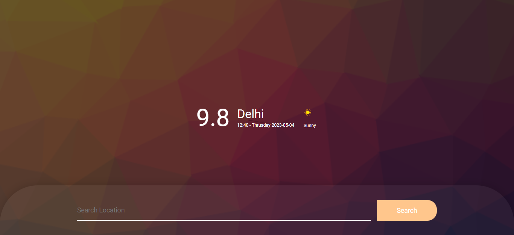

# Weather App 

## Introduction

Creating a **Weather App** using HTML, CSS, JS.

 

## 🔗 Important Links

> ## Checkout the Website [Web Application](https://kartiksarwan2017.github.io/Weather_App/)

 

## Features

- **Search**

 User can able to search the location and climate condition of that location is displayed as output.

- **Displaying Weather Details**

 User can able to see the details of weather of that location that is being searched. The weather details
cosists of current time, today's date, temperature in celcius, climatic conditions of that location. 

## Getting Started With Project
- Fork the Project in your Repository.
- Clone the Forked Repository in your Local System.
- Open the github repository into vscode 
- Open the index.html file with live server.

## Tools Used

 

- Version Control System: Git
- VCS Hosting: GitHub
- Programming / Scripting: Vanilla JavaScript
- Integrated Development Environment: VSCode

## Screens

## Sign Up 

### Sign In

